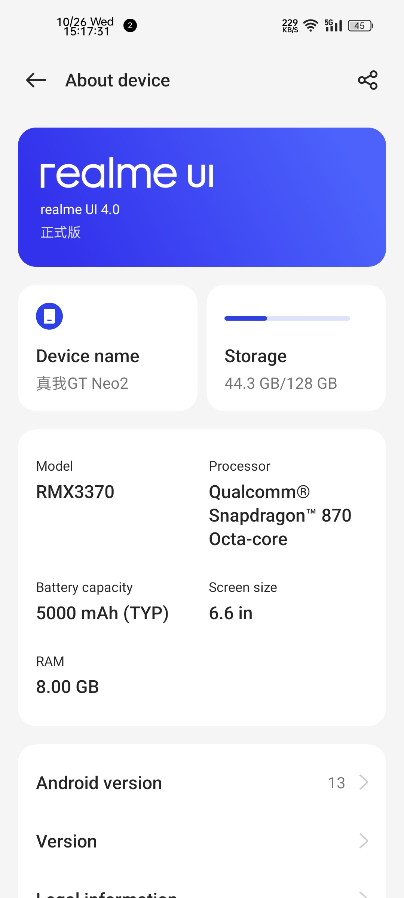
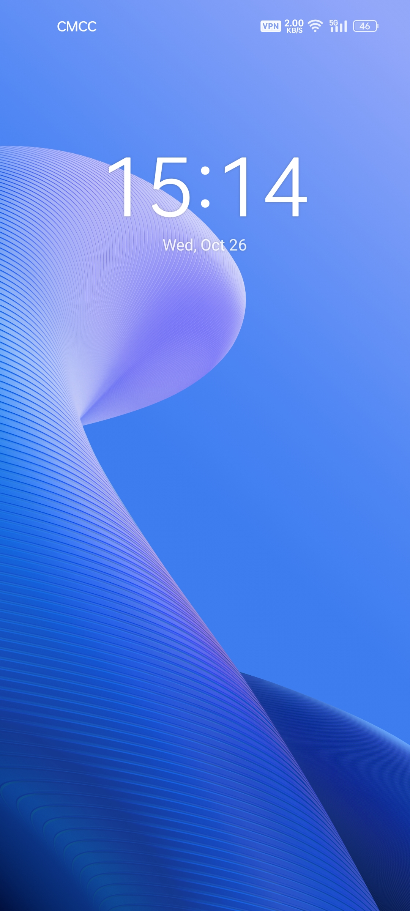
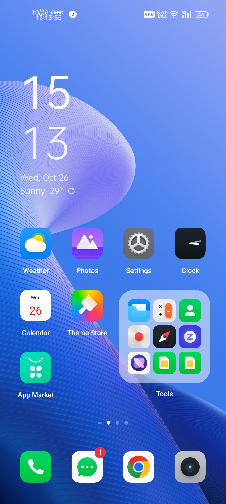
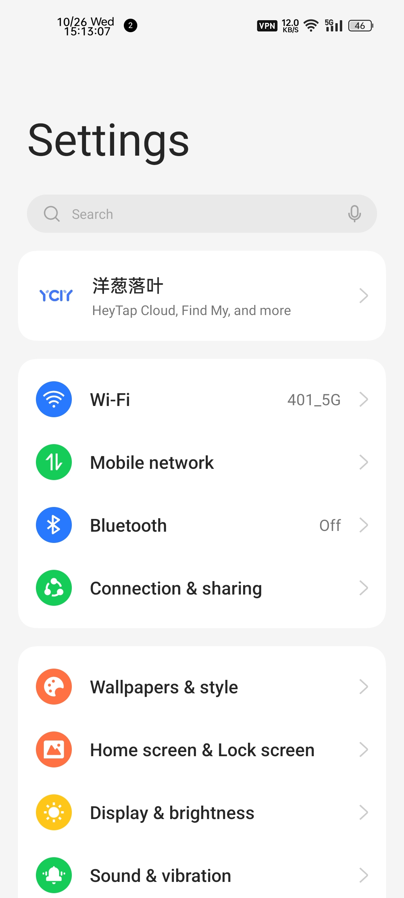
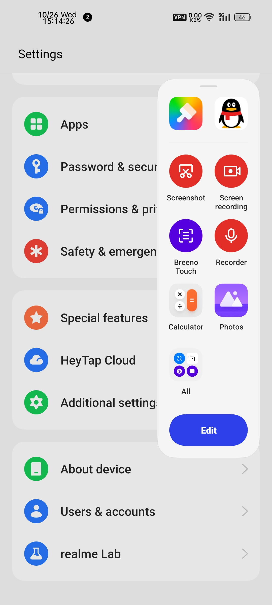
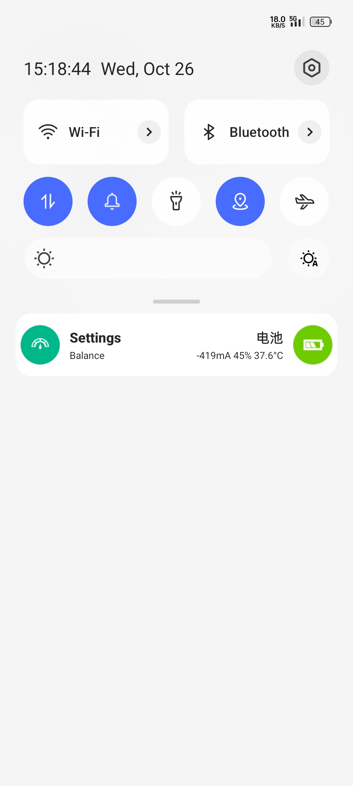

# realmeUI 4.0 for GT Neo2

## EN | [中](README.md)

## About
- Author: HFDan
- Repacker: ycly2333
- Ported from RMX3366CN_F.01
- Version: V2

**If you share this ROM, please keep the original author information**

### Warnings⚠️
- The flash tool will erase userdata of your device,plz backup your data before flashing!
- Make sure your device has been unlocked the bootloader!

> RUI 3.0 IN C.09 or GDPR C.08 or CN C.10 firmware is required before flashing.

### ROM changelog
- V2
1. Fixed Heytap Wallet
2. Reduce power consumption
3. Fixed DT2W

- V1
1. First version

## Bugs

- The maximum brightness is too low after the DC dimming is turned on in the settings.
- Svooc charge with the GDPR firmware.

## Screenshots

## Checksum

**MD5**：31dc3a0d9a54b8a9ce2dd4366004f87d

**CRC-32**：b7c7db74

**SHA-1**：e80ee7bf9500bf5b4c05db44806ba0fc1f08aa53

**SHA-256**：cfee0df2737d2a03f709c3863709a24518ec7ebe2039819c3a047c8e7f7ed52a

## Links
[MEGA](https://mega.nz/folder/ZGFwXDTZ#ZSGcm7Y3m-9E1NIq3zXUOA)
