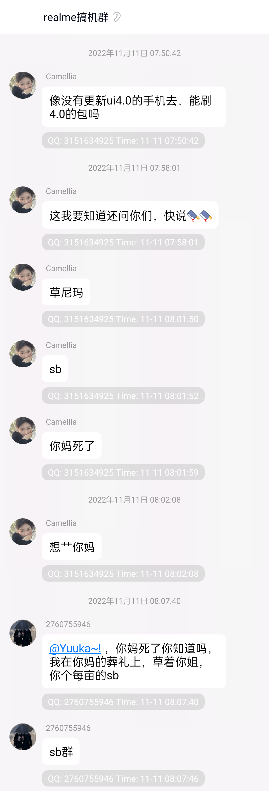
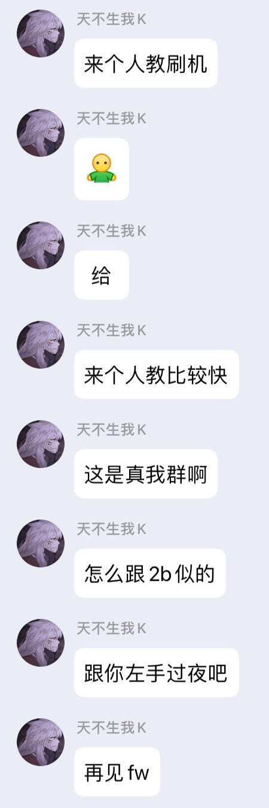
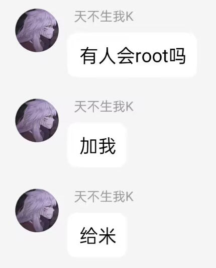

# realmeUI 4.0 for GT Neo2

## 关于
- 作者：小白afraid，洋葱落叶
- 版本：V5
> 基于RMX3366CN_F.03移植

**如果您转载本ROM包，请务必保留原作者信息**

### 警告⚠️
- 本ROM作者不对你的手机刷机后产生的一切设备故障或数据丢失负责！！
- 若继续尝试刷入此ROM，表示你了解刷机风险和并自行承担后果！！
- 请确保设备已经正常解锁Bootloader

> 底包要求：RMX3370CN_C.10

### 更新日志
- V5
1. 同步RMX3366CN_F.03版本
2. 修复启用游戏助手后导致王者荣耀等MOBA类游戏无法正常运行的问题

- V4
1. 修复开启DC调光后最大亮度太暗
2. DC调光开关位置从『开发者选项』移动到『realme实验室』
3. 去除心率检测

- V3
1. 同步RMX3366CN_F.02版本
2. 刷入过程中不再自动格式化data，刷入完成后自动重启至twrp

- V2
1. 修复钱包的NFC功能
2. 优化功耗
3. 修复双击亮屏

- V1
1. 第一版

## 注意事项
> *若遇到NFC偶尔无法使用的情况，请重启手机后重试*

## 截图

## QQ群

> 请确保您有充足的素质和基础的刷机知识再进群

## 校验码

**MD5**：1b5071e3301053656d53616d934925fb

**CRC-32**：2f49be93

**SHA-1**：18b379cd855d71d9713abacd56b6d7254f7de957

**SHA-256**：9749a1c3043e75634b0a29c307070a9fde884d2b14825f4fb538face3964fd5f

## 下载地址
[天翼云盘](https://cloud.189.cn/t/7fMZziruAfAz)

密码：1w2t
