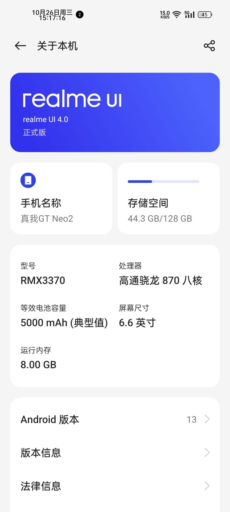
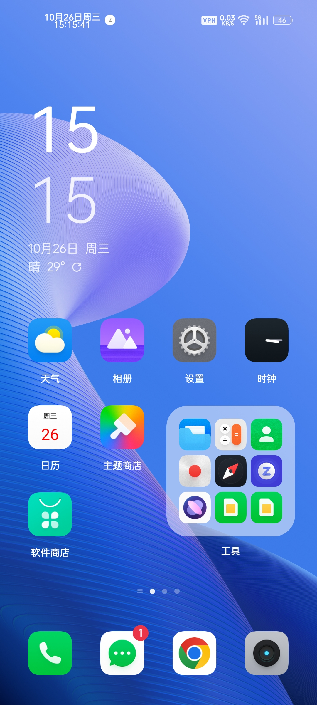

# realmeUI 4.0 for GT Neo2

## 中 | [EN](EN.md)

## 关于
- 作者：小白afraid
- 打包：洋葱落叶
- 基于RMX3366_F.01移植

**如果您转载本ROM包，请务必保留原作者信息**

### 警告⚠️
- 本工具作者不对你的手机刷机后产生的一切设备故障或数据丢失负责！！
- 刷入过程中会自动清除手机数据，请提前做好资料备份！！
- 若继续使用此工具，表示你了解刷机风险和并自行承担后果！！
- 请确保设备已经正常解锁Bootloader

> 底包要求：RMX3370CN_C.10

## 截图

## 校验码

**MD5**：b73e502c17fc00be1796cfca1ceec95e

**CRC-32**：2b6ca681

**SHA-1**：9554f53f61dd90cea132668af66631b56b8ff5ac

**SHA-256**：0284882e23d2926d9ad539f29c74e1624ae3ac4c845a9edef7f7c1c741e83043

## 下载地址
[天翼云盘](https://cloud.189.cn/t/7fMZziruAfAz)

密码：1w2t